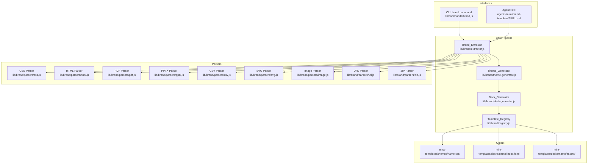
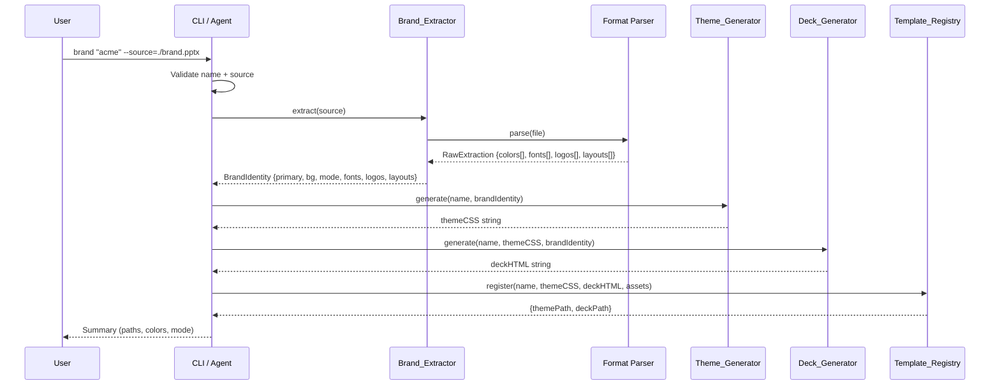

# Design Document: mira-brand-template

## Overview

The **mira-brand-template** feature adds a brand identity ingestion pipeline to Mira. Given corporate brand assets (PowerPoint, PDF, CSS, HTML, CSV, URL, ZIP, SVG, or images), it extracts visual identity elements (colors, typography, logos, layout patterns) and generates a registered Mira theme + deck template pair ready for `mira-new`.

The feature exposes two interfaces:
1. **CLI command** — `npx mira-animator brand <name> --source=<path|url>` for scripted/CI usage
2. **Agent skill** — `/mira-brand-template` for conversational, interactive extraction with override support

Both interfaces funnel through the same core pipeline: `Brand_Extractor → Theme_Generator → Deck_Generator → Template_Registry`.

### Design Decisions

| Decision | Rationale |
|----------|-----------|
| Single pipeline, dual interface | Avoids logic duplication; CLI and agent are thin wrappers |
| No new runtime deps except parsers | Keeps Mira lightweight; only add what file parsing requires |
| Output only to `mira-templates/` | Follows `mira-image-template` scope convention; `mira-new` discovers dynamically |
| Color quantization via `quantize` lib | Well-known, zero-dep median-cut algorithm; works in pure Node.js |
| PDF/PPTX via `pdf-parse` + `officegen`/`unzipper` | PPTX is a ZIP of XML; extract theme XML directly without heavy Office libs |

## Architecture



### Data Flow



## Components and Interfaces

### Brand_Extractor (`lib/brand/extractor.js`)

The orchestrator that selects the correct parser based on file type and normalizes results.

```typescript
interface ExtractorOptions {
  source: string;           // file path or URL
  timeout?: number;         // URL fetch timeout (default: 30000ms)
  maxFileSize?: number;     // override per-format limits
}

interface RawExtraction {
  colors: string[];         // hex codes, max 12
  fonts: string[];          // font family names, max 5
  logos: Buffer[];          // logo image buffers
  layouts: LayoutPattern[]; // extracted slide/page layouts
  sourceFormat: string;     // detected format identifier
}

interface BrandIdentity {
  primary: string;          // hex #RRGGBB
  secondary?: string;       // hex #RRGGBB, if detected
  background: string;       // hex #RRGGBB
  mode: 'light' | 'dark';  // derived from background luminance
  headingFont: string;      // font-family for headings
  bodyFont: string;         // font-family for body
  fontsDefaulted: boolean;  // true if no font metadata found
  logos: LogoAsset[];       // {buffer, filename, format}
  layouts: LayoutPattern[]; // card/slide patterns
  sourceFormat: string;
}

// Main entry point
async function extract(options: ExtractorOptions): Promise<BrandIdentity>
```

**Responsibilities:**
- Detect source type (path vs URL, file extension)
- Validate file size against per-format limits
- Delegate to the appropriate parser
- Merge results when source is ZIP (union colors up to 12, union fonts up to 5)
- Determine primary/secondary colors by frequency ranking
- Classify light/dark mode via WCAG luminance formula
- Return normalized `BrandIdentity` or throw descriptive errors

### Theme_Generator (`lib/brand/theme-generator.js`)

Produces a valid Mira CSS theme string from a `BrandIdentity`.

```typescript
interface ThemeGeneratorInput {
  name: string;             // template slug
  identity: BrandIdentity;
}

// Returns the complete CSS string for the theme file
function generateTheme(input: ThemeGeneratorInput): string
```

**Variable Derivation Rules (all deterministic):**

| Variable | Formula |
|----------|---------|
| `--mira-primary` | `identity.primary` |
| `--mira-bg` | `identity.background` |
| `--mira-text` | luminance(bg) < 0.5 ? `#ffffff` : `#1a1a1a` |
| `--mira-text-soft` | `rgba(T.r, T.g, T.b, 0.70)` |
| `--mira-text-softer` | `rgba(T.r, T.g, T.b, 0.50)` |
| `--mira-card-bg` | `rgba(T.r, T.g, T.b, 0.05)` |
| `--mira-card-border` | `rgba(T.r, T.g, T.b, 0.10)` |
| `--mira-glow-soft` | `rgba(P.r, P.g, P.b, 0.15)` |
| `--mira-glow-strong` | `rgba(P.r, P.g, P.b, 0.25)` |
| `--mira-icon-bg` | `rgba(P.r, P.g, P.b, 0.15)` |
| `--mira-icon-border` | `rgba(P.r, P.g, P.b, 0.30)` |
| `--mira-pill-bg` | `rgba(T.r, T.g, T.b, 0.04)` |
| `--mira-pill-border` | `rgba(T.r, T.g, T.b, 0.08)` |
| `--mira-stage-glow` | `rgba(P.r, P.g, P.b, 0.06)` |
| `--mira-accent-2` | `lighten(primary, 0.35)` → `round(C + (255-C)*0.35)` per component |

Where `T` = text color components, `P` = primary color components.

### Deck_Generator (`lib/brand/deck-generator.js`)

Produces a deck template HTML from the theme CSS and brand identity.

```typescript
interface DeckGeneratorInput {
  name: string;
  themeCSS: string;
  identity: BrandIdentity;
  baseCSSPath: string;      // path to base.css
  skeletonPath: string;     // path to aula-capitulo/index.html
}

function generateDeck(input: DeckGeneratorInput): string
```

**Responsibilities:**
- Read base skeleton (`aula-capitulo/index.html`)
- Inject theme CSS + base.css between `@MIRA:THEME` markers
- Update `<title>` to `Mira — Template: <Name>`
- Apply layout patterns to `<main>` if present
- Add Google Fonts `<link>` for custom fonts
- Preserve all CDN references (Tailwind, AOS, Lucide, D3)

### Template_Registry (`lib/brand/registry.js`)

Handles file writing and directory creation.

```typescript
interface RegistryInput {
  name: string;             // template slug
  themeCSS: string;
  deckHTML: string;
  assets: AssetFile[];      // {filename, buffer}
}

interface RegistryResult {
  themePath: string;        // relative path to theme file
  deckPath: string;         // relative path to deck template
  assetsPath: string;       // relative path to assets dir
}

async function register(input: RegistryInput): Promise<RegistryResult>
```

### Format Parsers (`lib/brand/parsers/`)

Each parser implements a common interface:

```typescript
interface ParseResult {
  colors: string[];         // hex codes found
  fonts: string[];          // font-family names found
  logos: Buffer[];          // logo image buffers
  layouts: LayoutPattern[]; // structural patterns
}

// Each parser exports:
async function parse(source: string | Buffer, options?: object): Promise<ParseResult>
```

| Parser | Strategy |
|--------|----------|
| `css.js` | Regex scan for hex, rgb(), rgba(), hsl(), hsla(), named colors; font-family declarations |
| `html.js` | Parse as DOM, extract inline styles + `<style>` blocks, delegate CSS extraction |
| `pdf.js` | Use `pdf-parse` for text/metadata; extract embedded colors from content streams |
| `pptx.js` | Unzip PPTX, parse `ppt/theme/theme1.xml` for color scheme + fonts |
| `csv.js` | Parse rows, match color patterns (hex/rgb/hsl) and font name columns |
| `svg.js` | Parse XML, extract `fill`, `stroke`, `font-family`, `font-size` attributes |
| `image.js` | Load pixels via `sharp` or canvas, run median-cut quantization for dominant colors |
| `url.js` | Fetch with timeout, extract `<style>`, computed colors from inline styles |
| `zip.js` | Decompress, filter eligible files, delegate to other parsers, merge results |

### CLI Command (`lib/commands/brand.js`)

```typescript
export default async function brand(args: string[]): Promise<void>
```

Thin wrapper: parse args → validate → call pipeline → print summary.

### Utility Functions (`lib/brand/color-utils.js`)

```typescript
// Parse any color format to {r, g, b}
function parseColor(color: string): {r: number, g: number, b: number}

// WCAG relative luminance (0.0 = black, 1.0 = white)
function luminance(r: number, g: number, b: number): number

// Lighten by mixing with white at given ratio
function lighten(hex: string, ratio: number): string

// Validate kebab-case template name
function isValidTemplateName(name: string): boolean

// Reserved names list
const RESERVED_NAMES: string[]
```

## Data Models

### BrandIdentity

The central data structure flowing through the pipeline:

```javascript
{
  primary: '#E63946',       // dominant brand accent color
  secondary: '#457B9D',    // optional secondary accent
  background: '#1D3557',   // background/canvas color
  mode: 'dark',           // 'light' | 'dark' from luminance
  headingFont: 'Montserrat',
  bodyFont: 'Open Sans',
  fontsDefaulted: false,
  logos: [
    { buffer: <Buffer>, filename: 'logo.svg', format: 'svg' }
  ],
  layouts: [
    { type: 'grid', columns: 2, hasHero: true, description: 'Two-column with hero header' }
  ],
  sourceFormat: 'pptx'
}
```

### LayoutPattern

```javascript
{
  type: 'grid' | 'single' | 'hero-content' | 'split',
  columns: 1 | 2 | 3,
  hasHero: boolean,
  hasFooter: boolean,
  description: string       // human-readable layout description
}
```

### AssetFile

```javascript
{
  filename: string,         // e.g., 'logo.svg', 'card-01.png'
  buffer: Buffer,
  type: 'logo' | 'card-template'
}
```

### Per-Format Size Limits

| Format | Max Size |
|--------|----------|
| PowerPoint (.ppt, .pptx) | 100 MB |
| PDF | 100 MB |
| CSS | 10 MB |
| HTML | 10 MB |
| CSV | 10 MB |
| SVG | 10 MB |
| Image (PNG, JPG, WEBP) | 50 MB |
| ZIP | 200 MB (max 50 eligible files, no nested ZIPs) |

### Reserved Template Names

```javascript
const RESERVED_NAMES = [
  'mira-dark', 'light-minimal', 'corporate-blue', 'neon-emerald',
  'aula-capitulo', 'pitch-projeto', 'demo-tecnica'
];
```

### Template Name Validation

Pattern: `^[a-z][a-z0-9-]{1,48}[a-z0-9]$`
- 3 to 50 characters
- Starts with lowercase letter
- Ends with letter or digit
- Only lowercase alphanumeric and hyphens

## Correctness Properties

*A property is a characteristic or behavior that should hold true across all valid executions of a system — essentially, a formal statement about what the system should do. Properties serve as the bridge between human-readable specifications and machine-verifiable correctness guarantees.*

### Property 1: Text-format color and font extraction completeness

*For any* valid CSS, HTML, SVG, or CSV content containing N distinct color declarations (hex, rgb, rgba, hsl, hsla) and M distinct font-family declarations, the Brand_Extractor SHALL return all N colors (up to 12) and all M font families (up to 5) present in the source.

**Validates: Requirements 1.3, 1.4, 1.5, 1.8**

### Property 2: Multi-source merge preserves union with caps

*For any* set of RawExtraction results from multiple files in a ZIP archive, the merged result SHALL contain the union of all unique colors capped at 12 and the union of all unique font families capped at 5, with no duplicates.

**Validates: Requirements 1.7**

### Property 3: Light/dark classification correctness

*For any* background color with RGB components (R, G, B), when the WCAG relative luminance (computed as `0.2126*Rlin + 0.7152*Glin + 0.0722*Blin` on linearized sRGB) is below 0.5, the mode SHALL be classified as "dark"; otherwise it SHALL be classified as "light".

**Validates: Requirements 2.3, 3.4**

### Property 4: Theme CSS variable contract completeness

*For any* valid BrandIdentity with a primary color and a background color, the Theme_Generator SHALL produce a CSS string containing exactly all 15 `--mira-*` variable declarations: `--mira-primary`, `--mira-bg`, `--mira-text`, `--mira-text-soft`, `--mira-text-softer`, `--mira-card-bg`, `--mira-card-border`, `--mira-glow-soft`, `--mira-glow-strong`, `--mira-icon-bg`, `--mira-icon-border`, `--mira-pill-bg`, `--mira-pill-border`, `--mira-stage-glow`, `--mira-accent-2`.

**Validates: Requirements 3.1, 8.2**

### Property 5: Theme variable derivation correctness

*For any* primary color (R, G, B) and derived text color (Tr, Tg, Tb), the Theme_Generator SHALL produce variables whose values exactly match the derivation formulas: `--mira-glow-soft` = `rgba(R, G, B, 0.15)`, `--mira-glow-strong` = `rgba(R, G, B, 0.25)`, `--mira-icon-bg` = `rgba(R, G, B, 0.15)`, `--mira-icon-border` = `rgba(R, G, B, 0.30)`, `--mira-stage-glow` = `rgba(R, G, B, 0.06)`, `--mira-text-soft` = `rgba(Tr, Tg, Tb, 0.70)`, `--mira-text-softer` = `rgba(Tr, Tg, Tb, 0.50)`, `--mira-card-bg` = `rgba(Tr, Tg, Tb, 0.05)`, `--mira-card-border` = `rgba(Tr, Tg, Tb, 0.10)`, `--mira-pill-bg` = `rgba(Tr, Tg, Tb, 0.04)`, `--mira-pill-border` = `rgba(Tr, Tg, Tb, 0.08)`, and `--mira-accent-2` = hex of `round(C + (255-C)*0.35)` per component.

**Validates: Requirements 3.2, 3.3, 3.5, 3.6, 3.7, 3.8**

### Property 6: Deck template structural integrity

*For any* generated deck template HTML, the output SHALL contain the markers `/* @MIRA:THEME:START */` and `/* @MIRA:THEME:END */` with CSS content between them, and SHALL contain CDN references to Tailwind (`cdn.tailwindcss.com`), AOS (`unpkg.com/aos`), Lucide (`unpkg.com/lucide`), and D3 (`d3js.org/d3.v7`).

**Validates: Requirements 4.3, 4.9, 8.1, 8.3**

### Property 7: Output path and naming consistency

*For any* generated template with slug S, the theme file SHALL be written to `mira-templates/themes/S.css` and the deck template SHALL be written to `mira-templates/decks/S/index.html`, and all output files SHALL reside exclusively within `mira-templates/`.

**Validates: Requirements 5.4, 7.6**

### Property 8: Template name validation

*For any* string, the name validator SHALL accept it if and only if it matches the pattern `^[a-z][a-z0-9-]{1,48}[a-z0-9]$` AND is not in the reserved names list (mira-dark, light-minimal, corporate-blue, neon-emerald, aula-capitulo, pitch-projeto, demo-tecnica).

**Validates: Requirements 6.2, 10.6**

### Property 9: Conditional font rule inclusion

*For any* BrandIdentity where the heading or body font is not "Inter", the Theme_Generator SHALL append a `body { font-family: ... }` rule after the `:root` block; when both fonts are "Inter" or defaulted, no such rule SHALL appear.

**Validates: Requirements 3.10, 4.10**

### Property 10: Error messages include contextual information

*For any* file path that does not exist on disk, the error message SHALL contain the exact path string. *For any* ZIP archive containing only unsupported file extensions, the error message SHALL list all file names found inside the archive.

**Validates: Requirements 10.1, 10.3**

### Property 11: Unsupported format error lists all supported formats

*For any* file with an extension not in the supported set (.ppt, .pptx, .pdf, .css, .html, .csv, .svg, .png, .jpg, .webp, .zip), the error message SHALL list all supported format extensions.

**Validates: Requirements 1.10**

## Error Handling

### Error Categories

| Category | Trigger | Behavior |
|----------|---------|----------|
| **File Not Found** | Local path doesn't exist | Exit 1 + message with exact path |
| **Unsupported Format** | Unknown file extension | Exit 1 + list all supported formats |
| **File Too Large** | Exceeds per-format limit | Exit 1 + message with format and max size |
| **URL Fetch Failure** | Timeout, DNS, HTTP error | Exit 1 + URL + failure reason |
| **Parse Error** | Corrupted/unreadable file | Exit 1 + filename + "verify integrity" suggestion |
| **Empty ZIP** | No eligible files in archive | Exit 1 + list found filenames + supported extensions |
| **Insufficient Data** | No colors extractable | Prompt user for primary color (agent) or exit 1 (CLI without --interactive) |
| **Reserved Name** | Name conflicts with built-in | Exit 1 + list all reserved names |
| **Existing Template** | Name already in use | Prompt for overwrite confirmation (interactive) or exit 1 (non-interactive) |
| **Missing Required Color** | No primary or background after extraction + prompt | Theme_Generator refuses to produce output + error indicating missing color |

### Error Propagation Strategy

```
Parser → throws FormatError with {format, filename, reason}
Extractor → catches parser errors, wraps in ExtractionError with user-friendly message
CLI/Agent → catches ExtractionError, prints formatted message, exits/responds appropriately
```

All errors include:
- What went wrong (plain language)
- Which file/URL caused it
- What the user can do about it (suggestion)

## Testing Strategy

### Dual Testing Approach

**Unit Tests (example-based)**:
- Each parser with representative sample files
- Edge cases: empty files, missing fonts, single-color sources
- Error conditions: corrupted files, oversized files, reserved names
- Integration points: CLI arg parsing, agent summary formatting

**Property-Based Tests (universal properties)**:
- Use `fast-check` library for property-based testing in Node.js
- Minimum 100 iterations per property
- Focus on the pure-function layers: color utilities, theme generation, name validation, merge logic

### Test Structure

```
tests/
├── unit/
│   ├── parsers/
│   │   ├── css.test.js
│   │   ├── html.test.js
│   │   ├── csv.test.js
│   │   ├── svg.test.js
│   │   ├── pptx.test.js
│   │   ├── pdf.test.js
│   │   ├── image.test.js
│   │   ├── url.test.js
│   │   └── zip.test.js
│   ├── theme-generator.test.js
│   ├── deck-generator.test.js
│   ├── color-utils.test.js
│   ├── name-validator.test.js
│   └── registry.test.js
├── property/
│   ├── theme-contract.property.js
│   ├── variable-derivation.property.js
│   ├── color-classification.property.js
│   ├── name-validation.property.js
│   ├── merge-invariants.property.js
│   ├── extraction-completeness.property.js
│   ├── deck-structure.property.js
│   ├── output-paths.property.js
│   ├── font-rule.property.js
│   ├── error-messages.property.js
│   └── unsupported-format.property.js
└── integration/
    ├── cli-brand-command.test.js
    ├── pipeline-end-to-end.test.js
    └── mira-new-discovery.test.js
```

### Test Framework

- **Runner**: `vitest` (fast, ESM-native, zero-config for Node.js)
- **Property testing**: `fast-check` (mature, well-maintained PBT library for JS/TS)
- **Assertions**: vitest built-in (`expect`)
- **Mocking**: vitest built-in (`vi.mock`, `vi.fn`)

### Property Test Configuration

Each property test file:
- Runs minimum 100 iterations (`{ numRuns: 100 }`)
- Tags with design property reference in a comment
- Uses `fc.pre()` for preconditions when needed

Example pattern:
```javascript
// Feature: mira-brand-template, Property 4: Theme CSS variable contract completeness
test.prop('all 15 --mira-* variables present for any valid brand identity',
  [arbBrandIdentity()], { numRuns: 100 },
  (identity) => {
    const css = generateTheme({ name: 'test', identity });
    for (const variable of ALL_MIRA_VARIABLES) {
      expect(css).toContain(variable);
    }
  }
);
```

### New Dependencies for Testing

| Package | Purpose |
|---------|---------|
| `vitest` | Test runner (dev dependency) |
| `fast-check` | Property-based testing (dev dependency) |

### New Dependencies for Runtime

| Package | Purpose |
|---------|---------|
| `pdf-parse` | PDF text/metadata extraction |
| `unzipper` | ZIP/PPTX decompression |
| `sharp` | Image pixel access for color quantization (optional; fallback to canvas) |
| `quantize` | Median-cut color quantization algorithm |

All runtime dependencies are peer/optional where possible to keep the core package light. The `brand` command lazy-imports them only when invoked.
